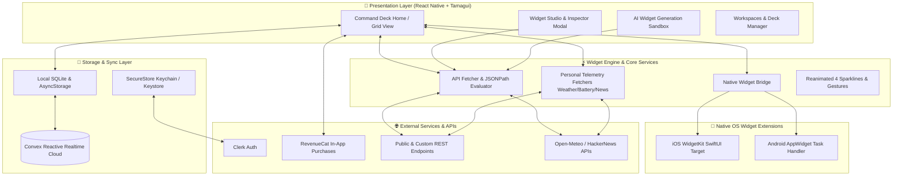

# 🐼 Pandra — Personal Telemetry & Modular Command Deck Studio

<div align="center">


### **The unified modular command deck & telemetry studio for mobile, desktop, and native home screen widgets.**

[](https://reactnative.dev)
[](https://expo.dev)
[](https://www.typescriptlang.org)
[](https://tamagui.dev)
[](https://convex.dev)
[](https://clerk.com)
[](https://revenuecat.com)
[](https://developer.apple.com/widgets/)
[](https://developer.android.com/guide/topics/appwidgets)
[](LICENSE)

[**Live Demo**](#-quick-start--setup-guide) • [**Judging Tour**](#-judges-evaluation-guide--feature-tour) • [**Architecture**](#-architecture--system-design) • [**Features**](#-key-features--innovation) • [**Native Widgets**](#-native-home-screen-widgets)

</div>

---

## 🌟 Executive Summary

Modern builders, developers, SREs, and data enthusiasts constantly juggle fragmented monitors: cloud metrics, server uptimes, GitHub repositories, crypto prices, system vitals, weather conditions, and personal notes. Mobile widgets have historically been static, limited, or constrained by rigid third-party apps.

**Pandra** solves this by providing an **autonomous, extensible personal telemetry command deck**. It combines a drag-and-drop studio with **8+ plug-and-play widget engines**, **real-time REST API JSONPath query extractors**, **natural language AI widget generation**, **offline-first reactive cloud sync**, and **full native home screen widget parity (iOS WidgetKit + Android AppWidgets)**.

---

## 🚀 Key Features & Innovation

### 1. ⚙️ 8+ Pluggable Widget Engine Modes
* **REST API Fetcher**: Connect to any HTTP JSON endpoint with custom polling intervals, sub-millisecond latency tracking, and dynamic **JSONPath extraction** (e.g., `stargazers_count`, `data.rates.USD`, `bitcoin.usd`).
* **Live Weather Telemetry**: Real-time atmospheric metrics & weather code detection powered by Open-Meteo with geolocation support.
* **Device Health & Vitals**: Battery percentage, charging telemetry, and hardware state monitoring.
* **Real-time News Feed**: Instant syndication from Hacker News, Dev.to, TechCrunch, and AI feeds.
* **Smart Interactive Counter**: Tappable step counters with customizable units, intervals, and persistent state.
* **Quick Scratchpad & Notes**: In-deck markdown notes, logs, and memo cards.
* **Curated Photo Frames**: Dynamic asset frames with custom aspect ratios and overlay captions.
* **System & Cloud Telemetry**: Compute status, database health, uptime trackers, and API latency benchmarks.

### 2. 🪄 AI-Powered Widget Generator
* Type natural language prompts such as *"Track Ethereum gas fees from Etherscan"* or *"Monitor my VPS ping every 60 seconds"*.
* Pandra's AI generator creates production-ready widgets instantly by parsing endpoints, assigning optimal color palettes, selecting iconography, and configuring data paths.

### 3. 🎨 Visual Command Studio & Customizer
* **3 Card Aesthetics**: Glassmorphic (`expo-glass-effect`), Solid Dark, and Neon Gradient themes.
* **Animated Sparkline Visualizers**: Real-time animated charts (Growth, Pulse, Volatile, Linear) driven by React Native Reanimated v4.
* **Dynamic Icon Matrix & Color Engine**: Curated palettes (Primary Blue, Cyan Sky, Emerald Green, Amber Gold, Neon Rose, etc.) with Lucide icon integration.
* **Fluid Drag-and-Drop Reordering**: Rearrange telemetry priorities in real-time with smooth gesture mechanics.

### 4. 📱 Native Home Screen Widgets (iOS & Android)
* **iOS (WidgetKit & SwiftUI)**: Written with `@expo/ui/swift-ui` and `expo-widgets` supporting Small, Medium, and Lock Screen Accessory rectangular widgets.
* **Android (AppWidgets)**: Native Android widget bridge via `react-native-android-widget` supporting 2x2 and 4x2 responsive widgets with periodic background task workers.
* **Instant Native Bridge (`native-widget-bridge.ts`)**: Synchronizes telemetry data directly to iOS App Groups (`group.com.joulessies.pandra`) and Android Shared Preferences.

### 5. 🗂 Multi-Deck Workspaces
* Switch between dedicated operational workspaces:
  * **Core Telemetry**: Primary server, API, and cloud health monitors.
  * **DevOps / SRE**: Latency benchmarks, uptime rates, compute loads, and build pipelines.
  * **Lifestyle & Personal**: Weather, battery, habit counters, and curated news.
  * **Crypto & Financial**: Real-time Bitcoin, Ethereum, Solana, and token market indices.
  * **Custom Workspaces**: Create, rename, and customize bespoke decks.

### 6. ☁️ Reactive Cloud Sync & Offline-First Architecture
* **Convex Cloud Backend**: Real-time reactive subscriptions that seamlessly sync decks, layouts, and telemetry across multiple devices.
* **Local Fallback Engine**: Local SQLite (`expo-sqlite`) and persistent AsyncStorage caching ensuring **zero latency** and **100% offline availability**.

### 7. 🔐 Enterprise-Ready Auth & Monetization
* **Clerk Authentication**: Seamless Google OAuth, email magic links, and token caching with `expo-secure-store`.
* **RevenueCat In-App Purchases**: Integrated subscription engine for Pro tiers, custom widget unlocks, and cloud syncing entitlements.

---

## 🏛 Architecture & System Design



---

## 🧭 Judges' Evaluation Guide & Feature Tour

To evaluate **Pandra**, follow this step-by-step feature checklist:

| Step | Feature to Test | Where to Look / What to Do | Expected Result |
|:---|:---|:---|:---|
| **1** | **Workspace Switching** | Header workspace pills (`Core`, `DevOps`, `Lifestyle`, `Crypto`) | Deck smoothly transitions widgets and telemetry with reanimated layouts. |
| **2** | **Create Custom API Widget** | Tap **`+ Add Widget`** ➔ select **REST API** ➔ choose **GitHub Stars** or **Bitcoin Spot** | Test endpoint fetches live JSON, parses data via JSONPath, and renders sparkline preview. |
| **3** | **AI Widget Generator** | Tap the ✨ **AI Sparkle** button ➔ Enter prompt (e.g. *"Monitor latency of api.github.com"*) | AI parses schema, generates widget metadata, and opens preview for 1-tap addition. |
| **4** | **Widget Inspector & Live Testing** | Tap any widget tile on the deck | Opens detailed telemetry inspector modal showing latency (ms), raw JSON payload, and refresh options. |
| **5** | **Drag & Drop Organization** | Tap the **Organize** button in the deck header | Widgets enter wiggle / reorder mode allowing seamless reordering. |
| **6** | **Native Home Screen Bridge** | Tap **Home Screen Widget** button in the studio | Displays setup guide and pushes telemetry to App Group / Android widget bridge. |
| **7** | **Offline & Cloud Sync** | Disconnect network or switch accounts | Local SQLite immediately serves cached widgets with zero blank-screen state. |

---

## 🛠 Tech Stack & Dependencies

| Category | Technology | Purpose |
|:---|:---|:---|
| **Core Framework** | [React Native 0.86](https://reactnative.dev) + [Expo SDK 57](https://expo.dev) | Cross-platform mobile runtime with New Architecture support |
| **Styling & Design** | [Tamagui 2.7](https://tamagui.dev) + [Vanilla CSS Tokens](src/theme/token.ts) | High-performance styling, responsive layouts, design tokens |
| **Animations** | [React Native Reanimated 4](https://docs.swmansion.com/react-native-reanimated/) + Worklets | 60 FPS sparkline graphs, smooth card transitions, gestures |
| **Backend & Sync** | [Convex Cloud](https://convex.dev) | Reactive cloud database for deck sync and telemetry history |
| **Local Storage** | [Expo SQLite](https://docs.expo.dev/versions/latest/sdk/sqlite/) + `@react-native-async-storage` | Offline-first database and fast local persistence |
| **Authentication** | [Clerk Expo](https://clerk.com/docs/quickstarts/expo) + [Expo SecureStore](https://docs.expo.dev/versions/latest/sdk/securestore/) | OAuth, secure token handling, user management |
| **Monetization** | [RevenueCat](https://www.revenuecat.com/) | In-App Subscriptions & Pro tier paywalls |
| **iOS Widgets** | [`expo-widgets`](https://expo.dev) + `@expo/ui/swift-ui` | Native Swift / SwiftUI WidgetKit targets |
| **Android Widgets** | [`react-native-android-widget`](https://github.com/sBugalsky/react-native-android-widget) | Native Android AppWidget remote views & background handlers |
| **Typography** | Inter, JetBrains Mono, Space Grotesk | Engineering-grade telemetry aesthetics |

---

## 📦 Quick Start & Setup Guide

### Prerequisites
- **Node.js**: `v18.x` or `v20.x`
- **Package Manager**: `npm` (or `yarn` / `bun`)
- **Expo CLI**: `npx expo`
- **Mobile Environment**: [Expo Go](https://expo.dev/go), iOS Simulator (Mac/Xcode), or Android Emulator (Android Studio).

### 1. Clone the Repository
```bash
git clone https://github.com/Joulessies/pandra.git
cd pandra
```

### 2. Install Dependencies
```bash
npm install
```

### 3. Environment Configuration
Copy the provided `.env.example` to `.env`:
```bash
cp .env.example .env
```
*(Pre-configured development keys for Convex, Clerk, and RevenueCat are included for smooth judge evaluation).*

### 4. Run the Application

#### Option A: Web Preview (Fastest test)
```bash
npm run web
```

#### Option B: Android / iOS Development
```bash
# Start the interactive Expo development server:
npx expo start

# Or launch directly into emulator:
npm run android
# or
npm run ios
```

---

## 📂 Repository Structure

```
pandra/
├── assets/                     # App icons, splash images, and visual assets
├── convex/                     # Convex reactive backend schema and deck mutations
│   ├── schema.ts               # Cloud schema for user decks and telemetry history
│   └── decks.ts                # Real-time queries and mutations
├── plugins/                    # Custom Expo config plugins
│   └── with-work-runtime-fix.js# Native build configuration plugin
├── src/
│   ├── app/                    # Expo Router file-based screens
│   │   ├── _layout.tsx         # Root provider wrapper (Auth, Theme, RevenueCat)
│   │   ├── index.tsx           # Main Command Deck screen & grid
│   │   ├── explore.tsx         # Studio, blueprints, and template explorer
│   │   └── (auth)/             # Clerk sign-in and authentication flows
│   ├── components/             # Reusable UI components & modals
│   │   ├── widgets/            # Core Widget Tile & Sparkline visualizer
│   │   ├── custom-widget-builder-modal.tsx  # Interactive visual widget builder
│   │   ├── ai-widget-generator-modal.tsx    # Natural language prompt generator
│   │   ├── widget-inspector-modal.tsx       # Live endpoint debugger & payload viewer
│   │   ├── draggable-widget-grid.tsx        # Drag-and-drop widget layout engine
│   │   ├── home-screen-widget-modal.tsx     # Native widget sync manager
│   │   └── paywall-modal.tsx                # RevenueCat subscription modal
│   ├── hooks/                  # Custom React hooks (RevenueCat, telemetry)
│   ├── providers/              # Auth Provider, Convex Client, RevenueCat Provider
│   ├── services/               # Core business logic
│   │   ├── api-fetcher.ts      # REST API evaluator, JSONPath parser, latency tester
│   │   ├── personal-widget-fetcher.ts # Weather, battery, and news feed services
│   │   ├── native-widget-bridge.ts    # iOS AppGroup & Android SharedPref bridge
│   │   ├── widget-storage.ts   # Local SQLite + AsyncStorage + Workspace manager
│   │   └── cloud-database.ts   # Convex synchronization service
│   ├── theme/                  # Design system tokens, color palettes, spacing
│   ├── types/                  # TypeScript interfaces for widgets and workspaces
│   └── widgets/                # Native iOS & Android Home Screen widget components
│       ├── PandraWidget.tsx           # iOS Swift-UI WidgetKit component
│       ├── PandraAndroidWidget.tsx    # Android RemoteViews widget component
│       └── android-widget-task-handler.tsx # Android background update worker
├── app.json                    # Expo & EAS configuration (bundle IDs, widgets)
├── eas.json                    # EAS Build & release profiles
├── package.json                # Project dependencies & scripts
└── tsconfig.json               # TypeScript strict configuration
```

---

## 🔒 Security & Privacy

* **Zero Credential Exposure**: API keys and tokens are saved in native secure storage (`expo-secure-store` Keychain / KeyStore).
* **Sandboxed Client Execution**: Custom JSONPath queries and REST API requests are executed in a sandboxed client runtime without arbitrary code evaluation.
* **Scoped Cloud Access**: Convex database schema enforces user-isolated indices (`by_user`) preventing cross-tenant telemetry access.

---

## 📄 License & Attribution

This project is licensed under the [MIT License](LICENSE).

<div align="center">
  <sub>Built with ❤️ for builders, developers, and data enthusiasts everywhere.</sub>
</div>
